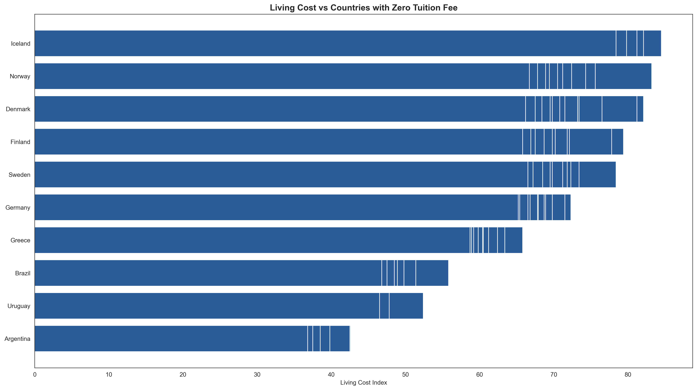
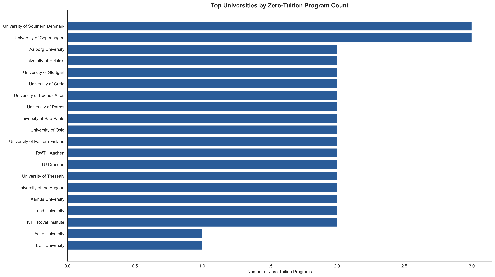
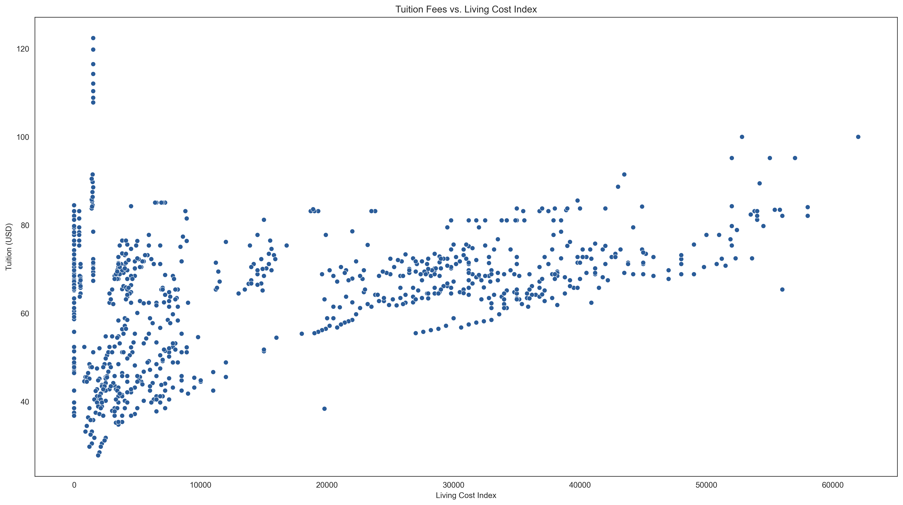

# 🎓 Cost of International Education

---

## 📝 Overview

This project analyzes the **cost of international education** across different countries. The goal is to uncover trends and draw insights that could help students make more informed decisions when planning their education abroad.

---

## 📌 Objectives

- Understand how education costs vary globally 🌍
- Identify countries with the highest and lowest tuition fees
- Visualize patterns and correlations with helpful plots
- Derive actionable insights from the data

---

## 🧠 Approach

- Collected and cleaned the dataset for missing or inconsistent values  
- Performed **Exploratory Data Analysis (EDA)** to identify trends and patterns  
- Used **data visualization** tools like Seaborn and Matplotlib for impactful graphs  
- Analyzed the top & bottom countries based on tuition fee distribution  
- Highlighted significant differences between public and private institutions  

---

## 📊 Tools & Technologies

| Tool/Library     | Purpose                        |
|------------------|--------------------------------|
| Python           | Core programming               |
| Pandas           | Data wrangling and cleaning    |
| NumPy            | Numerical operations           |
| Matplotlib       | Data visualization             |
| Seaborn          | Statistical visualization      |
| Jupyter Notebook | Development and presentation   |

---

## 📈 Sample Visualizations

Here’s a snapshot:

